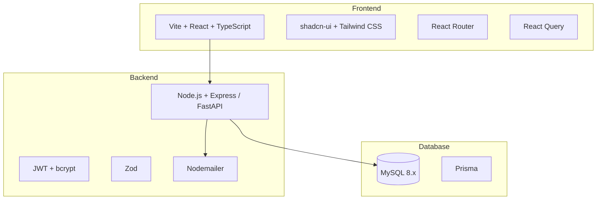
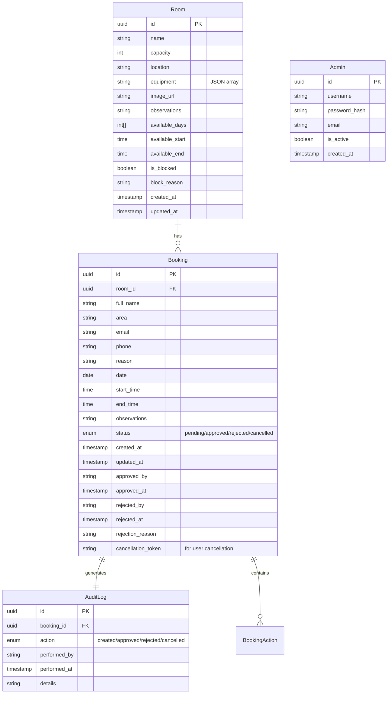
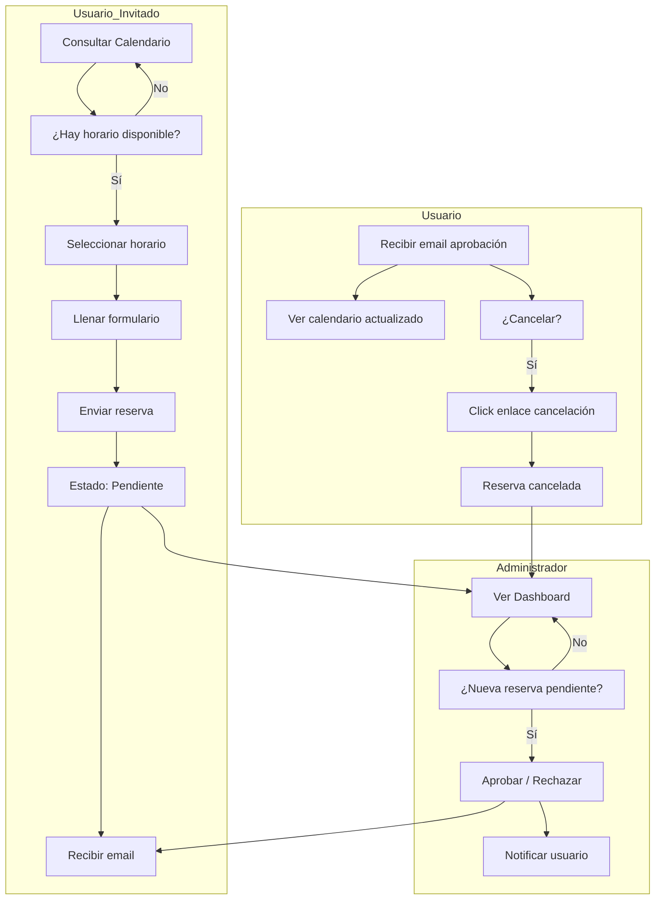

# Plan de Trabajo - Room Booker Plus

## Sistema de Reservación de Salas de Reuniones

---

## 1. Resumen del Estado Actual

### Frontend (Existente)
El proyecto ya cuenta con una maquetación funcional creada en Lovable con las siguientes características:

| Componente | Estado | Descripción |
|------------|--------|-------------|
| **Rutas** | ✅ Parcial | Index, RoomDetail, Login, Dashboard, Bookings, History, Settings |
| **Tipos TypeScript** | ✅ Completo | Room, Booking, TimeSlot, BookingFormData, AuditLog |
| **Mock Data** | ✅ Básico | 4 salas, 3 reservas de ejemplo |
| **Componentes UI** | ✅ shadcn-ui | Calendar, Dialog, Form, Table, Charts, etc. |
| **Calendario** | ⚠️ Básico | Vista semanal simple sin agrupamiento de bloques |
| **Formulario Reserva** | ⚠️ Básico | Sin autocompletado desde calendario |
| **Autenticación** | ❌ Mock | Solo UI, sin backend real |

---

## 2. Arquitectura Propuesta

### 2.1 Stack Tecnológico Recomendado



### 2.2 Justificación de Decisiones Técnicas

| Decisión | Opción Recomendada | Razón |
|----------|-------------------|-------|
| **Backend** | Node.js + Express | Consistencia con frontend (TypeScript), ecosistema maduro |
| **Base de Datos** | MySQL Server | Accesible en tu infraestructura, configuración simple |
| **ORM** | Prisma | Type-safety completo, migración fácil, DX excelente |
| **Autenticación** | JWT + bcrypt | Simple, sin registro de usuarios, solo admin |
| **Notificaciones** | Gmail / SendGrid API | Sin acceso a servidor SMTP interno |
| **Deployment** | Railway / Render / VPS | Acceso web externo, sin acceso a servidor interno |

---

## 3. Modelo de Datos

### 3.1 Diagrama Entidad-Relación



### 3.2 Descripción de Entidades

#### Room (Salas)
Almacena la información de cada sala de reuniones con sus características y restricciones de horario.

#### Booking (Reservas)
Gestiona todas las reservas con estados múltiples y tokens para cancelación por usuario.

#### AuditLog (Auditoría)
Registro inmutable de todas las acciones realizadas en el sistema.

#### Admin (Administradores)
Usuarios con acceso al panel de administración.

---

## 4. Plan de Trabajo por Fases

### Fase 1: Backend y Base de Datos (2-3 semanas)

#### 1.1 Configuración del Proyecto Backend
```
[x] Crear estructura de proyecto backend/
[x] Inicializar package.json con dependencias
[x] Configurar TypeScript
[x] Crear archivo docker-compose.yml
[x] Configurar variables de entorno (.env)
```

#### 1.2 Base de Datos
```
[x] Configurar SQL Server (servidor propio)
[x] Definir esquema Prisma con provider SQL Server
[x] Ejecutar migraciones
[x] Crear seed data (salas iniciales)
[x] Configurar conexión a base de datos
```

#### 1.3 API REST
```
[x] Endpoint Salas:
    GET    /api/rooms              - Listar todas
    GET    /api/rooms/:id          - Detalle de sala
    POST   /api/rooms              - Crear sala
    PUT    /api/rooms/:id          - Actualizar sala
    PUT    /api/rooms/:id/block    - Bloquear sala
    PUT    /api/rooms/:id/unblock  - Desbloquear sala

[x] Endpoint Reservas:
    GET    /api/bookings           - Listar (con filtros)
    GET    /api/bookings/calendar  - Calendario por sala/semana
    POST   /api/bookings           - Crear reserva
    GET    /api/bookings/:id       - Detalle de reserva
    PUT    /api/bookings/:id/approve   - Aprobar
    PUT    /api/bookings/:id/reject     - Rechazar
    PUT    /api/bookings/:id/cancel     - Cancelar (admin)
    POST   /api/bookings/:id/cancel-user - Cancelar (usuario)

[x] Endpoint Auth:
    POST   /api/auth/login         - Login admin
    POST   /api/auth/verify         - Verificar token

[x] Endpoint Historial:
    GET    /api/history            - Historial completo
    GET    /api/audit/:bookingId   - Auditoría de reserva
    GET    /api/audit/room/:roomId - Auditoría por sala
    GET    /api/audit/stats/summary - Estadísticas
```

---

### Fase 2: Integración Frontend-Backend (1-2 semanas) ✅ COMPLETADA

#### 2.1 Configuración API Client
```
[x] Crear API client con Fetch
[x] Configurar interceptors para JWT
[x] Crear hooks personalizados con React Query
```

#### 2.2 Integración de Páginas
```
[x] Index.tsx:
    - Conectar API para lista de salas
    - Actualizar mock data con datos reales
    
[x] RoomDetail.tsx:
    - Conectar API para detalle de sala
    - Integrar calendario con endpoint /calendar
    - Implementar formulario de reserva POST
    
[x] Admin:
    - [x] Conectar Dashboard con estadísticas API
    - [x] Conectar Bookings con lista de reservas
    - [x] Conectar History con endpoint de historial
    - [x] Conectar Settings con gestión de salas
```

---

### Fase 3: Mejoras Específicas del Calendario (1 semana)

#### 3.1 Visualización de Ocupación Agrupada
```
[ ] Modificar componente WeeklyCalendar.tsx
[ ] Implementar lógica de agrupamiento de bloques consecutivos
[ ] Mostrar texto unificado: "Ocupada · 10:00 – 12:00 (120 min)"
[ ] Eliminar repetición de texto en sub-bloques
```

#### 3.2 Selección Dinámica de Horarios
```
[ ] Implementar click en hora inicio
[ ] Calcular automáticamente hasta qué hora está libre
[ ] Agregar funcionalidad de arrastrar/extender
[ ] Actualizar formulario en tiempo real:
    - Hora inicio
    - Hora fin
    - Duración total
[ ] Validar límites:
    - Hasta siguiente evento ocupado
    - Hasta cierre de horario de sala
```

---

### Fase 4: Sistema de Notificaciones (3-5 días)

#### 4.1 Configuración de Emails
```
[ ] Crear cuenta en servicio SMTP (Gmail / SendGrid / Mailgun)
[ ] Configurar Nodemailer con credenciales del servicio
[ ] Crear plantillas de email:
    - Confirmación de reserva creada (a admin)
    - Aprobación de reserva (a usuario)
    - Rechazo de reserva (a usuario)
    - Cancelación exitosa (a usuario)
[ ] Usar variables de entorno para credenciales
```

#### 4.2 Tokens de Cancelación
```
[ ] Generar token único al crear reserva
[ ] Almacenar en campo cancellation_token
[ ] Crear endpoint público para cancelación:
    GET /api/bookings/cancel/:token
    POST /api/bookings/cancel/:token
```

---

### Fase 5: Seguridad y Deploy (1 semana)

#### 5.1 Seguridad
```
[ ] Validación de entradas con Zod
[ ] Rate limiting
[ ] CORS configurado correctamente
[ ] Helmet.js para headers seguros
[ ] Sanitización de HTML en campos de texto
```

#### 5.2 Documentación
```
[ ] Documentar API (Swagger/OpenAPI)
[ ] README con instrucciones de instalación
[ ] Variables de entorno documentadas
```

#### 5.3 Deployment
```
[ ] Opción 1: Railway / Render (fácil, gratuito para empezar)
    - Conectar repositorio GitHub
    - Configurar variables de entorno
    - Deploy automático
    
[ ] Opción 2: VPS propio (DigitalOcean / Linode)
    - Docker para contenedor
    - Nginx como reverse proxy
    - Certbot para SSL (HTTPS)
    
[ ] Base de datos MySQL:
    - Opción A: MySQL en Railway/Render (add-on)
    - Opción B: PlanetScale / ClearDB (MySQL managed)
    - Opción C: MySQL en VPS propio

[ ] Frontend:
    - Lovable: Share -> Publish (ya configurado)
    - O migrate a Vercel/Netlify
```

---

## 5. Diagrama de Flujo del Sistema



---

## 6. Endpoint de Calendario (Detallado)

### GET /api/bookings/calendar

**Parámetros Query:**
```
?roomId=uuid&weekStart=YYYY-MM-DD
```

**Respuesta:**
```json
{
  "roomId": "uuid",
  "weekStart": "2026-01-13",
  "days": [
    {
      "date": "2026-01-13",
      "slots": [
        {
          "time": "08:00",
          "status": "available",
          "bookingId": null
        },
        {
          "time": "08:30",
          "status": "occupied",
          "bookingId": "uuid",
          "duration": 120,
          "endTime": "12:00"
        }
      ]
    }
  ]
}
```

---

## 7. Reglas de Negocio Clave

| Regla | Implementación |
|-------|----------------|
| Sin registro de usuario | Solo email para contacto |
| Múltiples reservas pendientes permitidas | Validar solo en aprobación |
| Solo una reserva aprobada por horario | Validación en endpoint approve |
| Sin cruces de días | Validación de fecha en formulario |
| Auditoría completa | Crear registro en cada acción |
| Sin eliminación de datos | Solo cambio de estado (soft delete) |

---

## 8. Próximos Pasos Inmediatos

### Para Aprobación:

1. **Confirmar stack tecnológico:**
   - Node.js + Express ✅
   - MySQL Server ✅
   - Prisma ORM ✅
   - Docker ✅

2. **Infraestructura de Email:**
   - Servicio SMTP externo (Gmail/SendGrid/Mailgun)
   - Sin acceso a servidor SMTP interno de la empresa

3. **Deployment:**
   - Frontend: Lovable (ya tiene URL pública)
   - Backend: Railway / Render / Vercel / VPS propio
   - Base de datos: MySQL Server externo o hosting con MySQL

4. **Timeline objetivo:**

---

## 9. Estimación de Effort (Sin Tiempo)

| Fase | Complejidad | Componentes Principales |
|------|-------------|------------------------|
| Fase 1: Backend + DB | Alta | API REST, PostgreSQL, Prisma, Docker |
| Fase 2: Integración FE | Media | Axios, React Query, hooks personalizados |
| Fase 3: Calendario | Media-Alta | Lógica de agrupamiento, drag-select |
| Fase 4: Notificaciones | Baja-Media | Nodemailer, plantillas email |
| Fase 5: Seguridad + Deploy | Baja | Docker, documentación |

---

## 10. Archivos a Crear/Modificar

### Nuevos Archivos (Backend)
```
backend/
├── package.json
├── tsconfig.json
├── .env.example
├── docker-compose.yml
├── Dockerfile
├── prisma/
│   ├── schema.prisma
│   └── migrations/
├── src/
│   ├── index.ts
│   ├── app.ts
│   ├── config/
│   │   ├── database.ts
│   │   └── email.ts
│   ├── controllers/
│   │   ├── roomController.ts
│   │   ├── bookingController.ts
│   │   └── authController.ts
│   ├── services/
│   │   ├── roomService.ts
│   │   ├── bookingService.ts
│   │   └── emailService.ts
│   ├── routes/
│   │   ├── rooms.ts
│   │   ├── bookings.ts
│   │   └── auth.ts
│   ├── middleware/
│   │   ├── auth.ts
│   │   └── validation.ts
│   └── utils/
│       └── helpers.ts
└── swagger/
    └── openapi.yaml
```

### Modificaciones (Frontend)
```
src/
├── api/
│   ├── client.ts
│   ├── rooms.ts
│   ├── bookings.ts
│   └── auth.ts
├── hooks/
│   ├── useRooms.ts
│   ├── useBookings.ts
│   └── useAuth.ts
├── components/
│   ├── calendar/
│   │   └── WeeklyCalendar.tsx [MEJORAR]
│   └── booking/
│       └── BookingForm.tsx [MEJORAR]
└── pages/
    ├── Index.tsx [INTEGRAR]
    ├── RoomDetail.tsx [INTEGRAR]
    └── admin/
        ├── Dashboard.tsx [INTEGRAR]
        ├── Bookings.tsx [INTEGRAR]
        ├── History.tsx [INTEGRAR]
        └── Settings.tsx [INTEGRAR]
```

---

## Estado del Plan

| Sección | Estado |
|---------|--------|
| Análisis del frontend | ✅ Completado |
| Requisitos funcionales | ✅ Documentados |
| Arquitectura propuesta | ✅ Completada |
| Modelo de datos | ✅ Definido |
| Plan por fases | ✅ Elaborado |
| Reglas de negocio | ✅ Incluidas |

---

**Fecha de creación:** 2026-02-13  
**Versión:** 1.0  
**Modo:** Architect - Plan de Trabajo
